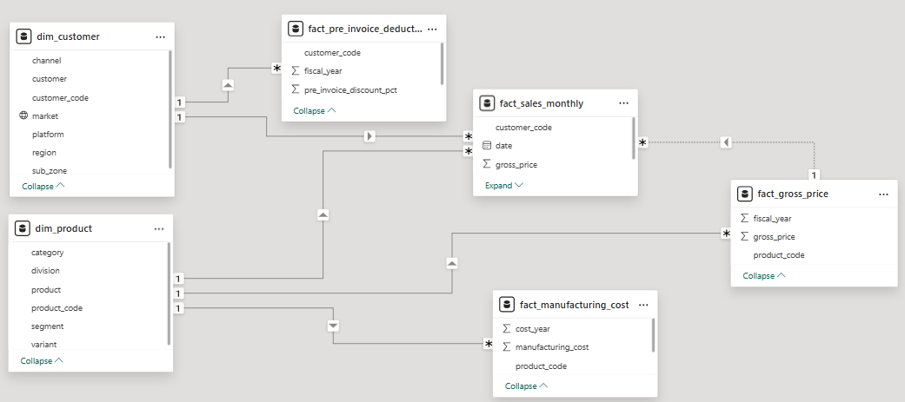

# Consumer_Goods_Ad-hoc_Analysis

# Consumer_Goods_Ad-hoc_Analysis

## Company Overview
 AtliQ Hardware (Imaginary Company) is one of the leading and rapidly expanding global hardware manufacturing company, specializing in a diverse range of products, more in various variants like standard, plus, and premium

---
## Problem Statement
 Management is struggling with slow, data-driven decision-making due to a lack of actionable insights from existing data systems.
 To address this, the company is expanding its data analytics team and has identified 10 ad-hoc requests for which insights are needed

 ---
## Task
Writing and executing SQL queries to answer these requests.
Creating a presentation to showcase these insights, targeting top-level management

---
## Approach
**1) Data Extraction with SQL:**

Used MySQL to write queries and fetch the needed data.

**2) Data Visualization:**

Used Power BI to create visuals that made the insights easy to understand and engaging.

**3) Presentation Design:**

Created a clear and professional presentation in Microsoft PowerPoint to share the insights.

**4) Actionable Insights:**

Provided actionable insights and recommendations to assist the management team in making informed decisions

---

## Data Model

---

## Outcome
This project showed my ability to work with complex data queries and share findings in a clear and engaging way. It helped me improve both my technical skills and my ability to explain insights effectively.

---

## How to Use

1. Run the SQL queries from the `Ad-hoc Analysis Answers` file on your MySQL-compatible database.
2. Open the Power BI `PowerBi visual file.pbix` file to explore the dashboard built using the query outputs.
3. Review the final presentation used to present the business findings to stakeholders.

   
---

## Acknowledgement

This project is part of the [Codebasics Resume Project Challenge](https://codebasics.io/challenge/codebasics-resume-project-challenge)
